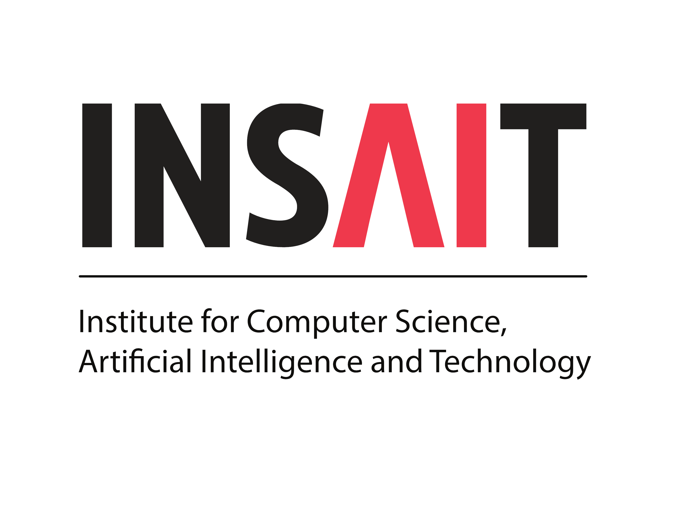

<!-- 导航标签页 -->
<nav class="page-tabs">
  <button class="tab-button active" data-tab="about">About Me</button>
  <button class="tab-button" data-tab="research">Research</button>
  <button class="tab-button" data-tab="professional">Professional & Academic Services</button>
  <button class="tab-button" data-tab="gallery">Gallery</button>
</nav>

<!-- About Me 内容 -->

👋 I am a **Ph.D. candidate** in the AI Thrust at HKUST(GZ). I am fortunate to be advised by [Prof. Xuming Hu @ HKUST](https://xuminghu.github.io/) and [Prof. Raymond Chi-Wing Wong @ HKUST](https://www.cse.ust.hk/~raywong/). Recently, I have also been collaborating with [Prof. Philip S. Yu @ UIC](https://scholar.google.com.hk/citations?user=D0lL1r0AAAAJ&hl=zh-CN&oi=ao), [Prof. Nicu Sebe @ UNITN](https://disi.unitn.it/~sebe/), [Linfeng Zhang @ SJTU](http://www.zhanglinfeng.tech/), and [Kailun Yang @ HNU](https://www.yangkailun.com/). 

I am currently a research visitor at [Queen Mary University of London](https://www.qmul.ac.uk/), collaborating with [Professor Ioannis (Yiannis) Patras](https://ipatras.github.io/) on digital avatars. I am also a researcher @ [Soul APP](https://www.soulapp.cn/), collaborating with research & engineer teams @ Soul AI for Hour-Scale Real-Time Human Animation. I had served as a **Resident Doctoral Researcher** at [INSAIT](https://insait.ai/) supervised by [Prof. Luc Van Gool](https://insait.ai/prof-luc-van-gool/) from 2025.02 to 2026.02. 

  <h3>Experience</h3>
  

    

      
      
Ph.D. Candidate

      
HKUST(GZ)

      
2022 - Present

    

    

      
      
Research Visitor

      
Queen Mary University of London

      
2026 - Present

    

    

      
      
Researcher

      
Soul APP

      
2025 - Present

    

    

      
      
Resident Doctoral Researcher

      
INSAIT

      
2025.02 - 2026.02

    

  

  <a href="https://scholar.google.com.hk/citations?hl=zh-CN&user=Ii1c51QAAAAJ" target="_blank">
    <i class="ai ai-google-scholar" style="font-size:1.2em; color:#4285F4;"></i>
    Google Scholar
    |
    
  </a>

<h3>Featured Open-Source Projects</h3>

  

    <svg class="gh-repo-icon" viewBox="0 0 16 16" width="16" height="16"><path d="M2 2.5A2.5 2.5 0 0 1 4.5 0h8.75a.75.75 0 0 1 .75.75v12.5a.75.75 0 0 1-.75.75h-2.5a.75.75 0 0 1 0-1.5h1.75v-2h-8a1 1 0 0 0-.714 1.7.75.75 0 1 1-1.072 1.05A2.495 2.495 0 0 1 2 11.5Zm10.5-1h-8a1 1 0 0 0-1 1v6.708A2.486 2.486 0 0 1 4.5 9h8ZM5 12.25a.25.25 0 0 1 .25-.25h3.5a.25.25 0 0 1 .25.25v3.25a.25.25 0 0 1-.4.2l-1.45-1.087a.249.249 0 0 0-.3 0L5.4 15.7a.25.25 0 0 1-.4-.2Z" fill="currentColor"></path></svg>
    <a href="https://github.com/Soul-AILab/SoulX-LiveAct" target="_blank">Soul-AILab / <strong>SoulX-LiveAct</strong></a>
  

  
Hour-Scale Real-Time Human Animation with Neighbor Forcing and ConvKV Memory. 20 FPS on 2x H100 GPUs.

  

    Python
    <svg viewBox="0 0 16 16" width="16" height="16"><path d="M8 .25a.75.75 0 0 1 .673.418l1.882 3.815 4.21.612a.75.75 0 0 1 .416 1.279l-3.046 2.97.719 4.192a.751.751 0 0 1-1.088.791L8 12.347l-3.766 1.98a.75.75 0 0 1-1.088-.79l.72-4.194L.818 6.374a.75.75 0 0 1 .416-1.28l4.21-.611L7.327.668A.75.75 0 0 1 8 .25Z" fill="currentColor"></path></svg>
  

  

    <svg class="gh-repo-icon" viewBox="0 0 16 16" width="16" height="16"><path d="M2 2.5A2.5 2.5 0 0 1 4.5 0h8.75a.75.75 0 0 1 .75.75v12.5a.75.75 0 0 1-.75.75h-2.5a.75.75 0 0 1 0-1.5h1.75v-2h-8a1 1 0 0 0-.714 1.7.75.75 0 1 1-1.072 1.05A2.495 2.495 0 0 1 2 11.5Zm10.5-1h-8a1 1 0 0 0-1 1v6.708A2.486 2.486 0 0 1 4.5 9h8ZM5 12.25a.25.25 0 0 1 .25-.25h3.5a.25.25 0 0 1 .25.25v3.25a.25.25 0 0 1-.4.2l-1.45-1.087a.249.249 0 0 0-.3 0L5.4 15.7a.25.25 0 0 1-.4-.2Z" fill="currentColor"></path></svg>
    <a href="https://github.com/EnVision-Research/DVD" target="_blank">EnVision-Research / <strong>DVD</strong></a>
  

  
Deterministic Video Depth Estimation with Generative Priors. SoTA using only 367K frames (163x less data).

  

    Python
    <svg viewBox="0 0 16 16" width="16" height="16"><path d="M8 .25a.75.75 0 0 1 .673.418l1.882 3.815 4.21.612a.75.75 0 0 1 .416 1.279l-3.046 2.97.719 4.192a.751.751 0 0 1-1.088.791L8 12.347l-3.766 1.98a.75.75 0 0 1-1.088-.79l.72-4.194L.818 6.374a.75.75 0 0 1 .416-1.28l4.21-.611L7.327.668A.75.75 0 0 1 8 .25Z" fill="currentColor"></path></svg>
  

  

    <svg class="gh-repo-icon" viewBox="0 0 16 16" width="16" height="16"><path d="M2 2.5A2.5 2.5 0 0 1 4.5 0h8.75a.75.75 0 0 1 .75.75v12.5a.75.75 0 0 1-.75.75h-2.5a.75.75 0 0 1 0-1.5h1.75v-2h-8a1 1 0 0 0-.714 1.7.75.75 0 1 1-1.072 1.05A2.495 2.495 0 0 1 2 11.5Zm10.5-1h-8a1 1 0 0 0-1 1v6.708A2.486 2.486 0 0 1 4.5 9h8ZM5 12.25a.25.25 0 0 1 .25-.25h3.5a.25.25 0 0 1 .25.25v3.25a.25.25 0 0 1-.4.2l-1.45-1.087a.249.249 0 0 0-.3 0L5.4 15.7a.25.25 0 0 1-.4-.2Z" fill="currentColor"></path></svg>
    <a href="https://github.com/zhengxuJosh/Awesome-RAG-Vision" target="_blank">zhengxuJosh / <strong>Awesome-RAG-Vision</strong></a>
  

  
A curated list of Retrieval-Augmented Generation (RAG) for Computer Vision, covering understanding, generation, and embodied AI.

  

    Markdown
    <svg viewBox="0 0 16 16" width="16" height="16"><path d="M8 .25a.75.75 0 0 1 .673.418l1.882 3.815 4.21.612a.75.75 0 0 1 .416 1.279l-3.046 2.97.719 4.192a.751.751 0 0 1-1.088.791L8 12.347l-3.766 1.98a.75.75 0 0 1-1.088-.79l.72-4.194L.818 6.374a.75.75 0 0 1 .416-1.28l4.21-.611L7.327.668A.75.75 0 0 1 8 .25Z" fill="currentColor"></path></svg>
  

  

    <svg class="gh-repo-icon" viewBox="0 0 16 16" width="16" height="16"><path d="M2 2.5A2.5 2.5 0 0 1 4.5 0h8.75a.75.75 0 0 1 .75.75v12.5a.75.75 0 0 1-.75.75h-2.5a.75.75 0 0 1 0-1.5h1.75v-2h-8a1 1 0 0 0-.714 1.7.75.75 0 1 1-1.072 1.05A2.495 2.495 0 0 1 2 11.5Zm10.5-1h-8a1 1 0 0 0-1 1v6.708A2.486 2.486 0 0 1 4.5 9h8ZM5 12.25a.25.25 0 0 1 .25-.25h3.5a.25.25 0 0 1 .25.25v3.25a.25.25 0 0 1-.4.2l-1.45-1.087a.249.249 0 0 0-.3 0L5.4 15.7a.25.25 0 0 1-.4-.2Z" fill="currentColor"></path></svg>
    <a href="https://github.com/zhengxuJosh/Awesome-Multimodal-Spatial-Reasoning" target="_blank">zhengxuJosh / <strong>Awesome-Spatial-Reasoning</strong></a>
  

  
State-of-the-art papers on spatial reasoning for Multimodal Vision-Language Models, covering 3D, embodied AI, and benchmarks.

  

    Markdown
    <svg viewBox="0 0 16 16" width="16" height="16"><path d="M8 .25a.75.75 0 0 1 .673.418l1.882 3.815 4.21.612a.75.75 0 0 1 .416 1.279l-3.046 2.97.719 4.192a.751.751 0 0 1-1.088.791L8 12.347l-3.766 1.98a.75.75 0 0 1-1.088-.79l.72-4.194L.818 6.374a.75.75 0 0 1 .416-1.28l4.21-.611L7.327.668A.75.75 0 0 1 8 .25Z" fill="currentColor"></path></svg>
  

## News


{{ news_content | markdownify }}

<!-- Research 内容 -->

My doctoral research develops robust and interpretable multi-modal learning algorithms spanning **perception**, **understanding**, **reasoning**, and **generation**. My two main doctoral research directions are:

  
<strong>Omnidirectional Vision</strong> (click to expand)

  

    

      <a href="https://openaccess.thecvf.com/content/CVPR2023/papers/Zheng_Both_Style_and_Distortion_Matter_Dual-Path_Unsupervised_Domain_Adaptation_for_CVPR_2023_paper.pdf"><strong>DPPASS</strong></a>
      CVPR 2023
    

    →
    

      <a href="http://openaccess.thecvf.com/content/ICCV2023/papers/Zheng_Look_at_the_Neighbor_Distortion-aware_Unsupervised_Domain_Adaptation_for_Panoramic_ICCV_2023_paper.pdf"><strong>DATR</strong></a>
      ICCV 2023
    

    →
    

      <a href="http://openaccess.thecvf.com/content/CVPR2024/papers/Zheng_Semantics_Distortion_and_Style_Matter_Towards_Source-free_UDA_for_Panoramic_CVPR_2024_paper.pdf"><strong>360SFUDA</strong></a>
      CVPR 2024
    

    <!-- →
    

      <a href="https://openaccess.thecvf.com/content/CVPR2024/papers/Zhang_GoodSAM_Bridging_Domain_and_Capacity_Gaps_via_Segment_Anything_Model_CVPR_2024_paper.pdf"><strong>GoodSAM</strong></a>
      CVPR 2024
    
 -->
    →
    

      <a href="https://dl.acm.org/doi/abs/10.1109/TPAMI.2024.3490619"><strong>360SFUDA++</strong></a>
      TPAMI 2025
    

    →
    

      <a href="https://openaccess.thecvf.com/content/ICCV2025/papers/Zhong_OmniSAM_Omnidirectional_Segment_Anything_Model_for_UDA_in_Panoramic_Semantic_ICCV_2025_paper.pdf"><strong>OmniSAM</strong></a>
      ICCV 2025 Highlight
    

    →
    

      <a href="https://arxiv.org/pdf/2506.21198"><strong>UNLOCK</strong></a>
      ICCV 2025
    

    →
    

      <a href="https://dl.acm.org/doi/pdf/10.1145/3743093.3770977"><strong>Pano-R1</strong></a>
      ACM MM Asia 2025
    

    →
    

      <a href="https://arxiv.org/pdf/2505.11907"><strong>OSR-Bench</strong></a>
      CVPR 2026
    

  

  
<strong>Multi-modal Visual Understanding</strong> (click to expand)

  

    

      <a href="http://openaccess.thecvf.com/content/CVPR2024/papers/Zhou_ExACT_Language-guided_Conceptual_Reasoning_and_Uncertainty_Estimation_for_Event-based_Action_CVPR_2024_paper.pdf"><strong>ExACT</strong></a>
      CVPR 2024 Highlight
    

    <!-- →
    

      <a href="http://openaccess.thecvf.com/content/CVPR2024/papers/Lyu_UniBind_LLM-Augmented_Unified_and_Balanced_Representation_Space_to_Bind_Them_CVPR_2024_paper.pdf"><strong>UniBind</strong></a>
      CVPR 2024
    
 -->
    →
    

      <a href="https://openaccess.thecvf.com/content/CVPR2024/papers/Zheng_EventDance_Unsupervised_Source-free_Cross-modal_Adaptation_for_Event-based_Object_Recognition_CVPR_2024_paper.pdf"><strong>EventDance</strong></a>
      CVPR 2024
    

    <!-- →
    

      <a href="https://arxiv.org/pdf/2309.09297"><strong>EOLO</strong></a>
      ICRA 2024
    
 -->
    →
    

      <a href="https://arxiv.org/pdf/2308.03135"><strong>EventBind</strong></a>
      ECCV 2024
    

    →
    

      <a href="https://arxiv.org/pdf/2407.11344"><strong>MAGIC</strong></a>
      ECCV 2024
    

    →
    

      <a href="https://arxiv.org/pdf/2407.11351"><strong>Any2Seg</strong></a>
      ECCV 2024 Oral
    

    →
    

      <a href="https://openaccess.thecvf.com/content/CVPR2025W/TMM-OpenWorld/papers/Liao_Benchmarking_Multi-modal_Semantic_Segmentation_under_Sensor_Failures_Missing_and_Noisy_CVPRW_2025_paper.pdf"><strong>MMSS-Bench</strong></a>
      CVPRW 2025 Best Paper
    

    <!-- →
    

      <a href="https://arxiv.org/pdf/2503.02581"><strong>SHIFTNet</strong></a>
      IROS 2025
    
 -->
    →
    

      <a href="https://arxiv.org/pdf/2505.06635"><strong>MFEnR</strong></a>
      ICCV 2025
    

    →
    

      <a href="https://arxiv.org/pdf/2505.12861"><strong>HPD</strong></a>
      CVPR 2026
    

  

My recent research interest lies in:

  

    
<strong>Multimodal Foundation Models</strong>

    

      

        <a href="http://openaccess.thecvf.com/content/CVPR2024/papers/Lyu_UniBind_LLM-Augmented_Unified_and_Balanced_Representation_Space_to_Bind_Them_CVPR_2024_paper.pdf"><strong>UniBind</strong></a>
        CVPR 2024
      

      →
      

        <a href="https://arxiv.org/pdf/2509.18639?"><strong>UiG</strong></a>
        Arxiv 2025
      

    

  

  
  

    
<strong>Scene Understanding & Spatial Intelligence</strong>

    

      

        <a href="https://dl.acm.org/doi/pdf/10.1145/3743093.3770977"><strong>Pano-R1</strong></a>
        ACM MM Asia 2025
      

      →
      

        <a href="https://arxiv.org/pdf/2510.06218"><strong>Egonight</strong></a>
        ICLR 2026
      

    

  

  

    
<strong>Novel / Omnidirectional Sensors</strong>

    

      

        <a href="https://arxiv.org/pdf/2404.16501"><strong>360SFUDA++</strong></a>
        TPAMI 2024
      

      →
      

        <a href="https://openaccess.thecvf.com/content/ICCV2025/papers/Zhong_OmniSAM_Omnidirectional_Segment_Anything_Model_for_UDA_in_Panoramic_Semantic_ICCV_2025_paper.pdf"><strong>OmniSAM</strong></a>
        ICCV 2025
      

    

  

  

    
<strong>AI Robustness & Security</strong>

    

      

        <a href="https://openaccess.thecvf.com/content/ICCV2025/papers/Lu_CIARD_Cyclic_Iterative_Adversarial_Robustness_Distillation_ICCV_2025_paper.pdf"><strong>CIARD</strong></a>
        ICCV 2025
      

      →
      

        <a href="https://arxiv.org/pdf/2511.21574"><strong>MRPD</strong></a>
        AAAI 2026
      

    

  

  

    
<strong>Artificial Intelligence Generated Content (AIGC)</strong>

    

      

        <a href="https://arxiv.org/pdf/2502.00848"><strong>RealRAG</strong></a>
        ICML 2025
      

      →
      

        <a href="https://github.com/Soul-AILab/SoulX-LiveAct"><strong>LiveAct</strong></a>
        arXiv 2026
      

    

  

  

I also survey papers in cutting-edge topics:

  

    
<strong>Survey Projects</strong>

    

      

        <a href="https://github.com/zhengxuJosh/Awesome-RAG-Vision"><strong>RAG for Computer Vision</strong></a>
      

      •
      

        <a href="https://github.com/zhengxuJosh/Awesome-Multimodal-Spatial-Reasoning"><strong>Multi-modal Spatial Reasoning</strong></a>
      

      •
      

        <a href="https://github.com/Chenfei-Liao/Awesome-360-Vision-Embodied-AI"><strong>360 Vision in Embodied AI</strong></a>
      

    

  

<!-- Professional & Academic Services 内容 -->

### Invited Talks

- **"Omnidirectional Vision: From Scene Understanding, Spatial Intelligence to Industrial Applications"**  
  *SPIC Energy Science and Technology Research Institute*, Shanghai, China, August 2025

- **"PANORAMA: Exploring the Industrial Potentials of Omnidirectional Vision"**  
  *Yangtze River Delta International Talent Port*, Wuxi, China, August 2025

- **"Retrieval-augmented Realistic Image Generation via Self-reflective Contrastive Learning"**  
  *VIVO*, Shenzhen, China, August 2025. Invited by [Dr. Kanzhi Wu](https://scholar.google.com.hk/citations?user=N0WHQ2wAAAAJ&hl=zh-CN&oi=ao)

### Mentorship

**Current:** 
[Chenfei Liao (MPhil, HKUST-GZ)](https://chenfei-liao.github.io/); [Zihao Dongfang (RA, HKUST-GZ)](https://scholar.google.com.hk/citations?hl=zh-CN&user=IvJ4_xsAAAAJ); [Ziqiao Weng (MPhil, HKUST-GZ)](https://katie312.github.io/)

**Past:** [Yuanhuiyi Lyu (PhD, HKUST-GZ)](https://qc-ly.github.io/); [Lutao Jiang (PhD, HKUST-GZ)](https://lutao2021.github.io/); [Jialei Chen (PhD, Nagoya)](https://psmobile.github.io/); Mengzhen Chi (PhD, NEU); Junha Moon (MPhil, HKUST-GZ); Kaiyu Lei (MPhil, HKUST-GZ); Leyi Sheng (UG, HKUST-GZ); Ding Zhong (MS, Michigan); Yunhao Luo (PhD, Umich); Tianbo Pan (PhD, NUS); Zhenquan Zhang (MPhil, SCUT); [Boyuan Zheng (MPhil, Tongji)](https://nathandrake67.github.io/zhengby.github.io/)

✉️ <strong>Feel free to contact me for discussion and collaboration!</strong>

### Academic Services



<!-- Gallery 内容 -->



<!-- 标签页切换JavaScript -->

